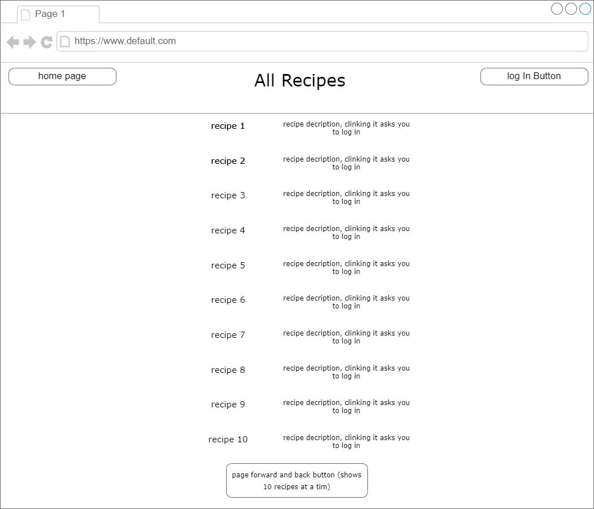
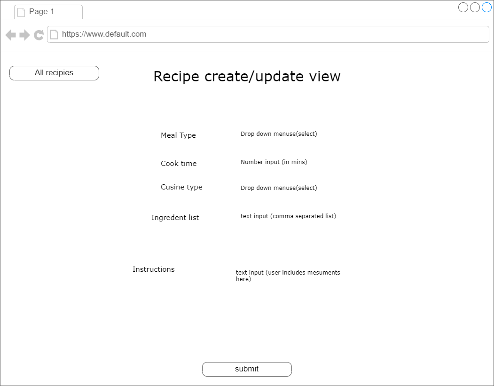

# Recipe Repo
A  Repository for all your recipies. Add all your favorite recipes to your cookbook and veiw other users recipes. The login with your google account.

## Tech Being Used
* HTML
* CSS
* JavaScript
* Express
* Mongoose
* EJS
* oAuth 2.0

## ERD
* user : recipe (1:M)
* recipes : ingredients (M:N)

## Restful Routing Chart
| HTTP METHOD (_Verb_) | URL (_Nouns_)            | CRUD   | Response                                           | Notes                        |
| -------------------- | ------------------------ | ------ | -------------------------------------------------- | ---------------------------- |
| GET                  | /                        | GET    | displays the landing/home page                     |                              |
| `users`              |                          |        |                                                    |                              |
| GET                  | /auth2callback           | R/C    | login or add user to database after google oauth   |                              |
| GET                  | /users/user:id           | READ   | display user cookbook with userId                  |                              |
| `recipes`            |                          |        |                                                    |                              |
| GET                  | /recipes                 | READ   | displays array of all recipes                      |                              |
| GET                  | /recipes/:recipesId      | READ   | display a single recipe with recipesId             |                              |
| GET                  | /recipes/new             | CREATE | display new recipe view                            | create/update uses same view |
| POST                 | /recipes                 | CREATE | create new recipe                                  |                              |
| GET                  | /recipes/:recipesId/edit | UPDATE | display new recipe view populated with recipe info | create/update uses same view |
| PUT/PATCH            | /recipes/:recipesId      | UPDATE | update user with recipesId                         |                              |
| DELETE               | /recipes/:recipesId      | DELETE | delete user with recipesId                         |                              |

## WireFrame

## User Stories
* As a user I want to signs in and out
* As a user and viewer I want to be able to see a list of all recipes in the database
* As a user I want to sees list of all My recipes (cookbook)
* As a user I want to see a recipe and ingredients
* As a user I want to create and update my recipes
* As a user I want to favorite recipes and add them to my cookbook
* As a user I want to create ingredients

## MVP Checklist
* user signs in and out
* user can see all recipes in database
* user CRUDs recipes
* user see a recipe details
* user sees all their recipes (cookbook)
* user CR ingredients

## Stretch Goals
* user can favorite recipes (add to cookbook)
* user CRUD comments on recipie
* comments:Recipies(M:N) & User:Comments(M:N)

## Maybe Roadblocks
* Feature creep
* Route mix up
